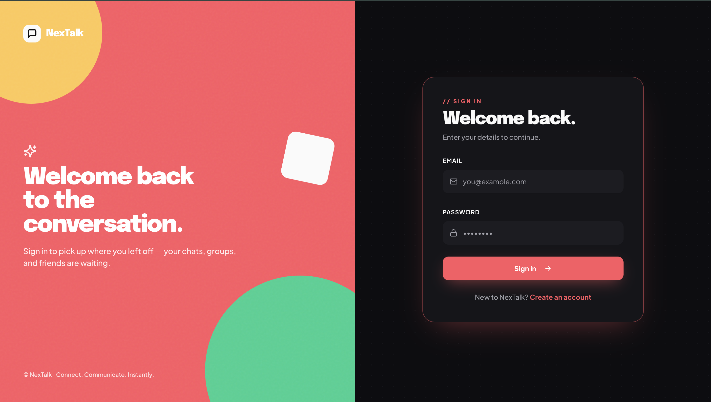
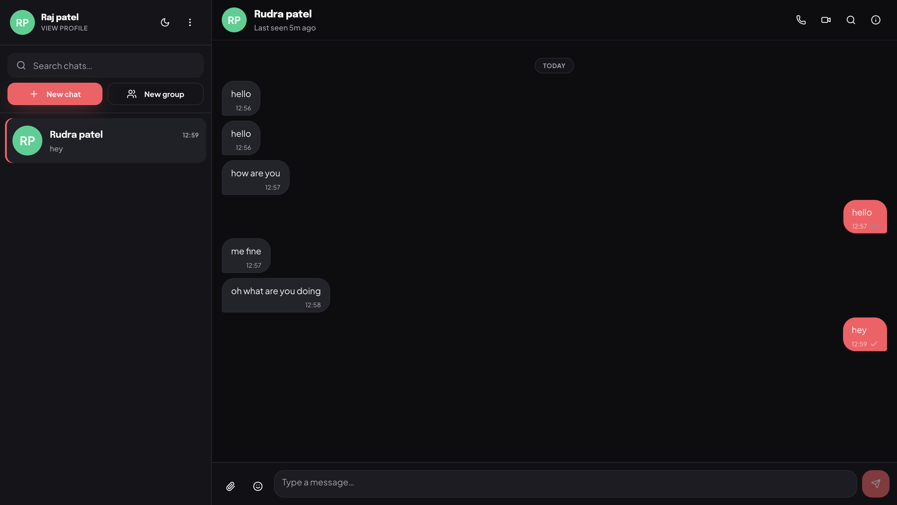
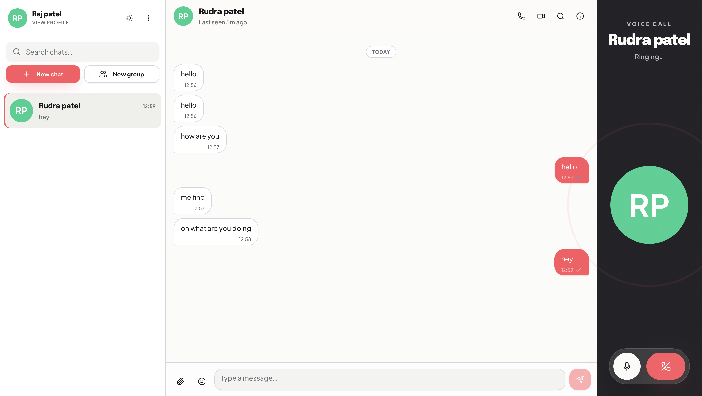
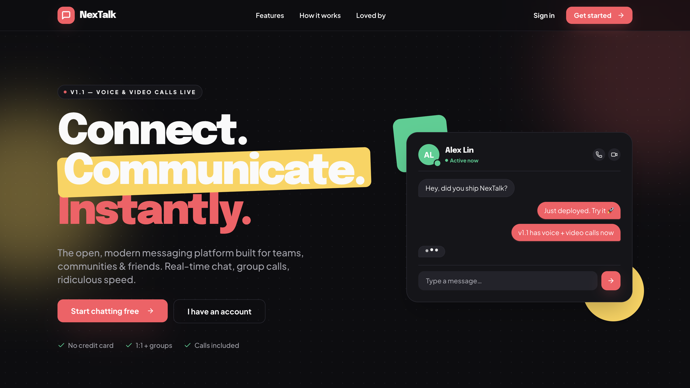

<div align="center">

# 🚀 NexTalk

### Real-Time Messaging & Calling Platform

Connect • Chat • Collaborate • Instantly


### ⚡ Modern Full-Stack Chat Application

NexTalk is a real-time messaging platform inspired by modern communication apps like WhatsApp, Discord, and Telegram. It provides instant messaging, online presence tracking, typing indicators, read receipts, and voice/video communication powered by WebSockets.

Built with scalability, responsiveness, and real-time communication in mind.

</div>

---

<div align="center">

## 🌐 Live Deployment

<a href="https://nex-talk-2k26.vercel.app">
  
</a>
<br><br>

**Frontend:** Vercel • **Backend:** Render • **Real-Time:** Socket.IO

</div>

# ✨ Features

## 💬 Real-Time Messaging

* One-to-one messaging
* Instant message delivery
* Real-time synchronization
* Chat history persistence
* Auto-scroll to latest messages
* Message status updates

## ⌨️ Typing Indicators

* Real-time typing detection
* Typing status synchronization
* Automatic timeout handling

## ✅ Read Receipts

* Message delivered status
* Message read status
* Real-time receipt updates

## 🟢 Online Presence

* Online / Offline tracking
* Active user detection
* Presence synchronization
* Automatic disconnect handling

## 📞 Voice & Video Calling

* Peer-to-peer communication
* Incoming call notifications
* Call acceptance/rejection flow
* Real-time signaling using Socket.IO

## 🔐 Secure Authentication

* JWT Authentication
* Protected routes
* Persistent login sessions
* Secure API access

## 🎨 Modern User Experience

* Responsive Design
* Mobile Friendly
* Tablet Optimized
* Desktop Optimized
* Dark Theme Support
* Modern UI Components

---

# 📊 Project Highlights

* Built a full-stack real-time communication platform.
* Implemented WebSocket communication using Socket.IO.
* Developed secure JWT-based authentication system.
* Designed scalable client-server architecture.
* Added online presence and typing indicators.
* Implemented real-time read receipts.
* Integrated voice/video call signaling.
* Optimized state management using Zustand.
* Deployed frontend on Vercel and backend on Render.

---

# 🏗️ System Architecture

```text
                    ┌─────────────────────┐
                    │      Frontend       │
                    │      React.js       │
                    │   Zustand Store     │
                    │ Tailwind + Shadcn   │
                    └──────────┬──────────┘
                               │
                        REST APIs
                               │
                               ▼
                    ┌─────────────────────┐
                    │      Backend        │
                    │      Express.js     │
                    │    JWT Auth APIs    │
                    └──────────┬──────────┘
                               │
                               ▼
                    ┌─────────────────────┐
                    │      MongoDB        │
                    │ User & Chat Storage │
                    └─────────────────────┘

                               ▲
                               │
                    Socket.IO Real-Time Layer
                               │
                               ▼

               Presence • Messaging • Calls
```

---

# 🛠️ Tech Stack

## Frontend

| Technology       | Purpose                 |
| ---------------- | ----------------------- |
| React.js         | Frontend Framework      |
| Zustand          | State Management        |
| Tailwind CSS     | Styling                 |
| Shadcn UI        | UI Components           |
| Axios            | API Requests            |
| Socket.IO Client | Real-Time Communication |

## Backend

| Technology | Purpose             |
| ---------- | ------------------- |
| Node.js    | Runtime Environment |
| Express.js | Backend Framework   |
| Socket.IO  | Real-Time Engine    |
| JWT        | Authentication      |
| bcrypt     | Password Hashing    |

## Database

| Technology | Purpose      |
| ---------- | ------------ |
| MongoDB    | Data Storage |
| Mongoose   | ODM          |

## Deployment

| Service | Purpose          |
| ------- | ---------------- |
| Vercel  | Frontend Hosting |
| Render  | Backend Hosting  |

---

# 📂 Project Structure

```bash
NexTalk
│
├── frontend
│   ├── public
│   ├── src
│   │   ├── components
│   │   ├── pages
│   │   ├── store
│   │   ├── hooks
│   │   ├── lib
│   │   └── constants
│
├── backend
│   ├── controllers
│   ├── middleware
│   ├── models
│   ├── routes
│   ├── sockets
│   ├── services
│   └── config
│
└── README.md
```

---

# ⚙️ Environment Variables

## Backend (.env)

```env
PORT=5000

MONGO_URI=

JWT_SECRET=

CLIENT_URL=http://localhost:3000
```

## Frontend (.env)

```env
REACT_APP_API_URL=http://localhost:5000

REACT_APP_SOCKET_URL=http://localhost:5000
```

---

# 🚀 Installation

## Clone Repository

```bash
git clone https://github.com/Rajpatel2924/NexTalk.git

cd NexTalk
```

---

## Install Frontend Dependencies

```bash
cd frontend

npm install
```

---

## Install Backend Dependencies

```bash
cd backend

npm install
```

---

# ▶️ Running the Application

## Start Backend

```bash
cd backend

npm run dev
```

## Start Frontend

```bash
cd frontend

npm start
```

---

# 🔌 Socket Events

## Presence

```javascript
user_online
user_offline
presence_update
```

## Messaging

```javascript
send_message
receive_message
message_delivered
message_read
```

## Typing

```javascript
typing_start
typing_stop
```

## Calling

```javascript
call_user
incoming_call
accept_call
reject_call
end_call
```

---

# 🔒 Security Features

* JWT Authentication
* Password Hashing (bcrypt)
* Protected API Routes
* Input Validation
* Secure Environment Variables
* CORS Configuration
* Secure WebSocket Communication

---

# 🧠 Engineering Challenges Solved

## Real-Time Synchronization

Ensured message consistency across multiple active clients using Socket.IO event broadcasting.

## Presence Tracking

Implemented robust online/offline detection with automatic reconnection handling.

## Read Receipts

Built a real-time delivery and read acknowledgement system.

## Socket Deployment

Successfully deployed a WebSocket-powered backend on Render while hosting the frontend separately on Vercel.

## State Management

Optimized application-wide state updates using Zustand to maintain a responsive UI.

---

<h2 align="center">📸 Application Screenshots</h2>


<table align="center">
<tr>
<td align="center" width="50%">


<br><br>

<b>🔐 Authentication System</b>

Secure JWT-based login and registration with protected routes and persistent sessions.

</td>

<td align="center" width="50%">


<br><br>

<b>💬 Real-Time Chat Interface</b>

Instant messaging with typing indicators, read receipts, and online presence tracking.

</td>
</tr>

<tr>
<td height="30"></td>
<td></td>
</tr>

<tr>
<td align="center" width="50%">


<br><br>

<b>📞 Voice & Video Calling</b>

Peer-to-peer calling experience with real-time Socket.IO signaling.

</td>

<td align="center" width="50%">


<br><br>

<b>🌙 Modern Dark Theme</b>

Clean and responsive dark mode optimized for desktop, tablet, and mobile devices.

</td>
</tr>
</table>

# 🚀 Future Enhancements

* Group Chats
* File Sharing
* Image Sharing
* Message Search
* Message Reactions
* Push Notifications
* Screen Sharing
* End-to-End Encryption
* AI Smart Replies
* Scheduled Messages

---

# 🤝 Contributing

Contributions are welcome.

1. Fork the repository

```bash
git fork
```

2. Create your feature branch

```bash
git checkout -b feature/new-feature
```

3. Commit your changes

```bash
git commit -m "Add new feature"
```

4. Push to the branch

```bash
git push origin feature/new-feature
```

5. Open a Pull Request

---

# 👨‍💻 Author

## Raj Patel

Software Engineer | Full Stack Developer

GitHub:
https://github.com/Rajpatel2924

LinkedIn:
https://www.linkedin.com/in/rajpatel2924/

---

# ⭐ Support

If you found this project helpful:

⭐ Star the repository

🍴 Fork the repository

📢 Share it with others

---

<div align="center">

### 🚀 NexTalk

Real-Time Messaging & Calling Platform

Built with ❤️ using React, Express, MongoDB, Socket.IO, Zustand & JWT

</div>
